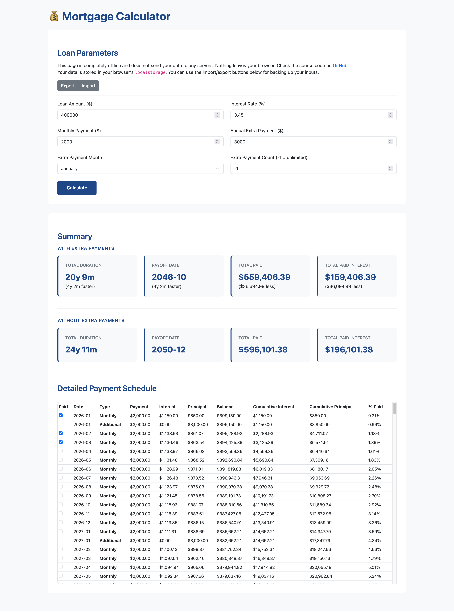

# Mortgage Calculator

A simple, offline mortgage calculator built with HTML, CSS, and JavaScript.

## Demo

## How to Use

1.  Enter the loan amount, interest rate, monthly payment, and annual extra payment.
2.  Select the extra payment month and the extra payment count.
3.  Click the "Calculate" button to see the results.

The results section will show a summary of the mortgage with and without extra payments, as well as a detailed payment schedule. Your data will be stored in your browser's `localstorage`. You can also import and export your data using the buttons provided.
